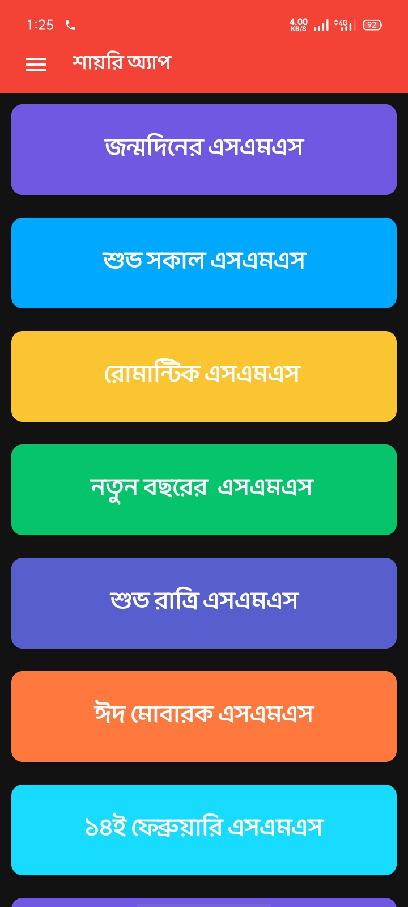

## General

Shayari App is created in Android Studio using Kotlin & Firebase.

<a id="raw-url" href="apk/Shayari App.apk?raw=true">
</a>

## Screenshots

|                                      Shayari                |                            AllShayari                         |                                                     |
| :------------------------------------------------------------------: | :-----------------------------------------------------------------: | :------------------------------------------------------------------: |
|   |  |  |

## Dependencies

- Firebase Dependencies

```
implementation 'com.google.firebase:firebase-messaging-ktx:23.0.0'
implementation 'com.google.firebase:firebase-firestore-ktx:24.0.1'
implementation 'com.google.firebase:firebase-storage-ktx:20.0.0'
```

